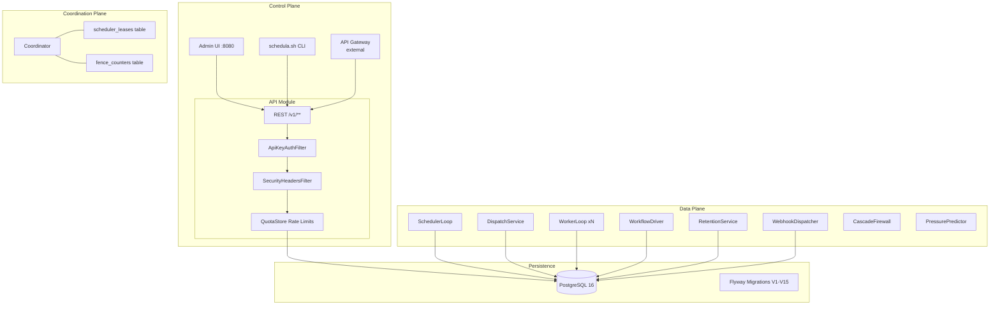
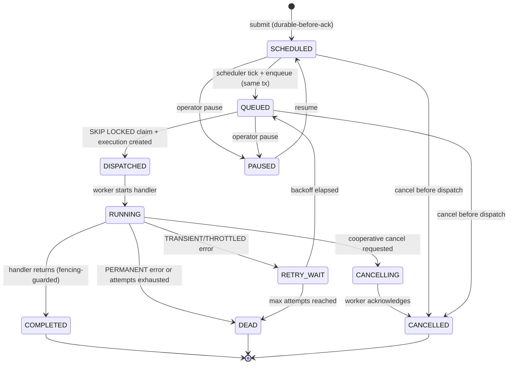
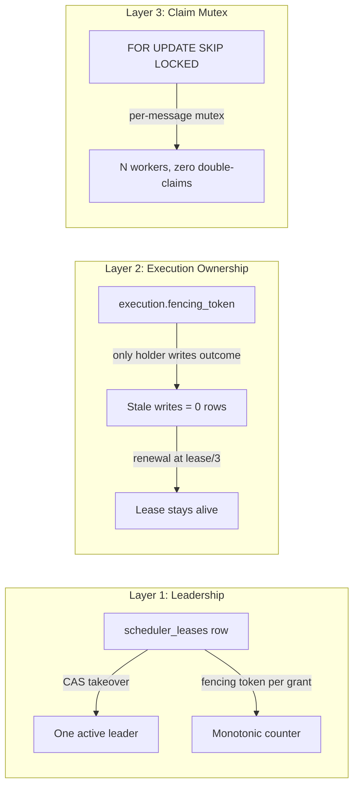
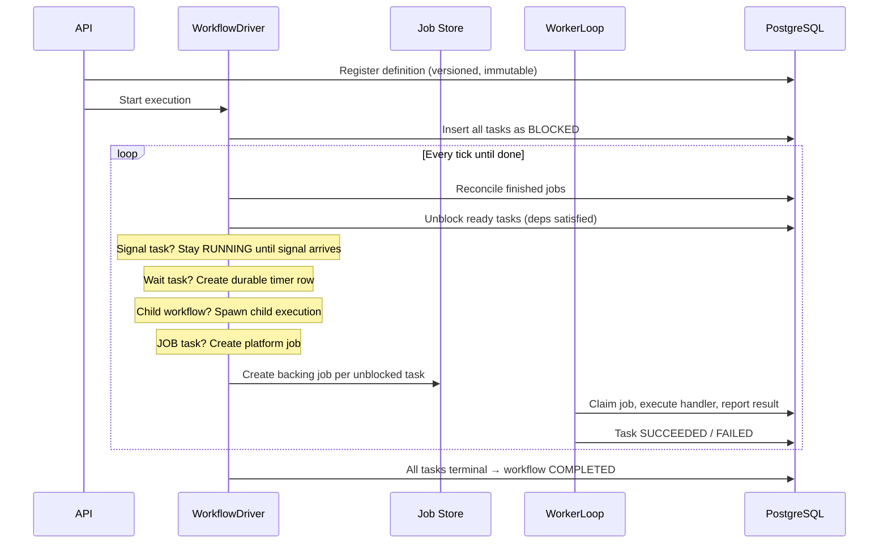
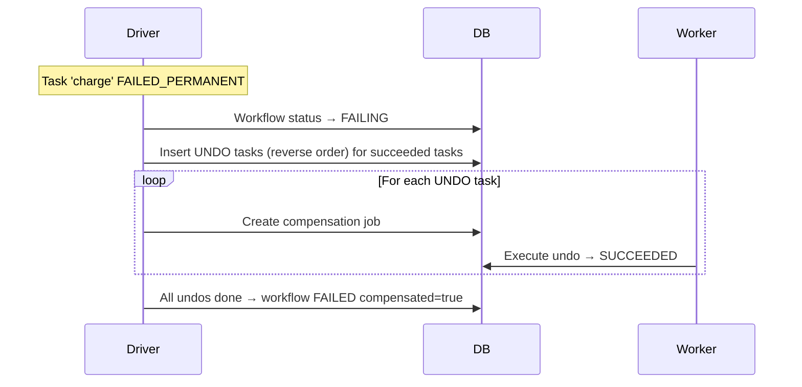
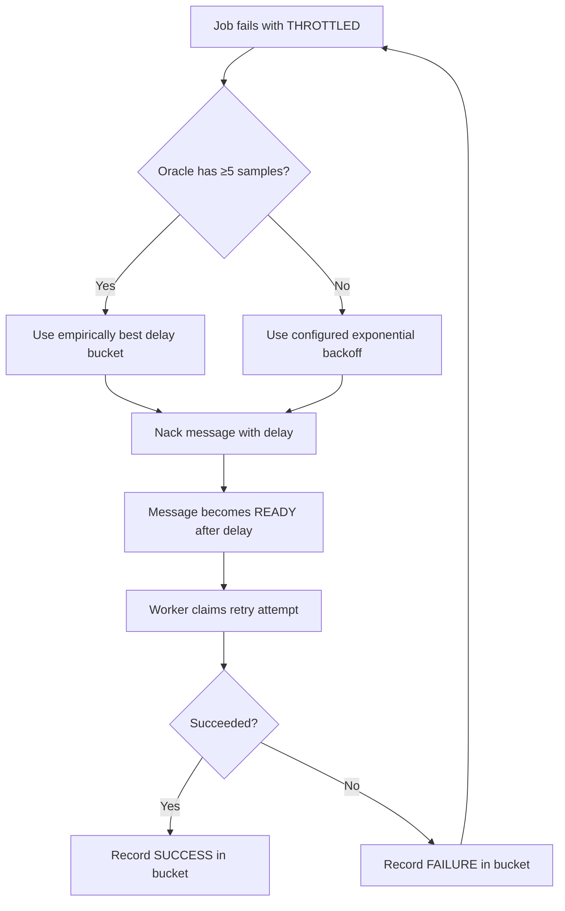
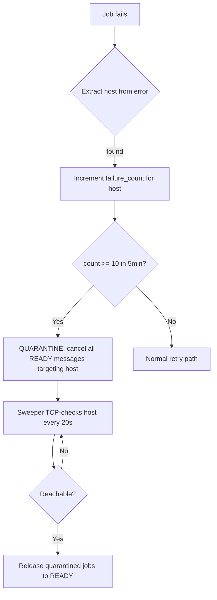

# Architecture

Schedula follows a **three-plane model**: Control Plane (what should run), Coordination Plane (who decides), and Data Plane (what actually runs). Every component is a Spring-managed bean inside a modular monolith that splits into separate processes via configuration flags.



## Three-Plane Separation

| Plane | Responsibility | Components | Failure behavior |
|-------|---------------|------------|------------------|
| Control | Accept work, validate, persist durably | API module | Returns errors if DB unreachable |
| Coordination | Decide WHO acts | Coordinator + lease/fence tables | Fail-closed: no leader = no scheduling |
| Data | Actually do work | WorkerLoop, SchedulerLoop, WorkflowDriver | Retry with backoff, fail-closed |

---

## Job Lifecycle

Every job follows this state machine. All transitions are **guarded database updates** — two racing writers cannot both succeed.



### Key invariant

> A COMPLETED job can never transition back to RUNNING. Only `POST /retry` creates a NEW job linked to the original.

---

## Distributed Locking (Three Layers)



### How stale owners are neutralized

When a worker loses its lease (GC pause, network partition), a new owner takes over. The old worker's fencing token no longer matches, so every UPDATE it attempts matches zero rows. The stale owner cannot corrupt state even though it still *believes* it owns the job.

```sql
-- This is what a stale worker's write looks like:
UPDATE job_executions SET status = 'COMPLETED'
WHERE id = ? AND fencing_token = 42   -- token is stale; new token = 43
-- Result: 0 rows affected. Write is silently discarded.
```

---

## Workflow Engine

Workflows are DAGs of tasks. Each task spawns a REAL platform job, inheriting retries, leases, timeouts, and DLQ handling.



### Compensation flow



---

## Adaptive Retry Oracle



---

## Cascade Failure Firewall



---

## Leader Election

```mermaid
sequenceDiagram
    participant F1 as Node A (Follower)
    participant F2 as Node B (Follower)
    participant DB as scheduler_leases table

    F1->>DB: CAS: acquire if expired or mine
    DB-->>F1: Token=42, expires in 15s
    Note over F1: A is LEADER with fence token 42

    F2->>DB: CAS: acquire (lease held by A, not expired)
    DB-->>F2: 0 rows → stay FOLLOWER

    A crashes (no renewal)

    DB->>DB: Lease expires after 15s
    F2->>DB: CAS: acquire (expired!)
    DB-->>F2: Token=43 (> 42), expires in 15s
    Note over F2: B is LEADER with fence token 43

    A wakes up, tries to renew token 42
    DB-->>A: 0 rows → STEP DOWN
    A tries fenced write with token 42
    DB-->>A: 0 rows → WRITE REJECTED
```

---

## Deployment Topologies

### Development (single JVM)

```
java -jar app.jar --schedula.roles.api=true --schedula.roles.scheduler=true --schedula.roles.worker=true
```

### Production (Kubernetes)

```
API Deployment (2 replicas)          ← readiness: /actuator/health/readiness
Scheduler Deployment (3 replicas)    ← leader-elected, PDB minAvailable=1
Worker Deployment (HPA-scaled)       ← subscribed_queues, capabilities, PDB
PostgreSQL StatefulSet or RDS        ← streaming replication recommended
Grafana + Prometheus                 ← dashboard JSON + alert rules included
OTel Collector                       ← OTLP traces endpoint
```

---

## Module Dependency Graph

```
app ──→ api ──→ persistence ──→ common
 │                │
 ├──→ engine ──→ coordination
 │         │         │
 │         ▼         │
 ├──→ worker-runtime
 │         │
 └──→ dispatcher ──→ queue
                      │
                      └──→ persistence
```

Each module has a single responsibility. Boundaries are enforced by Maven module scoping.
