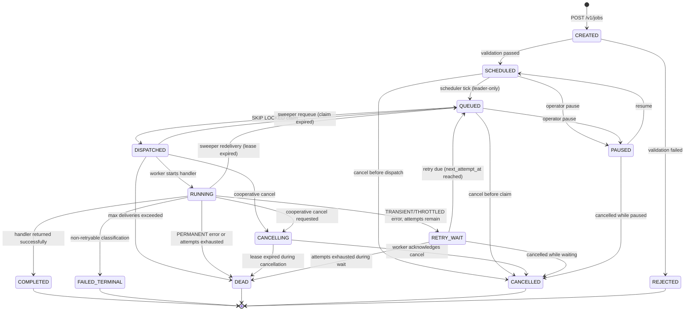
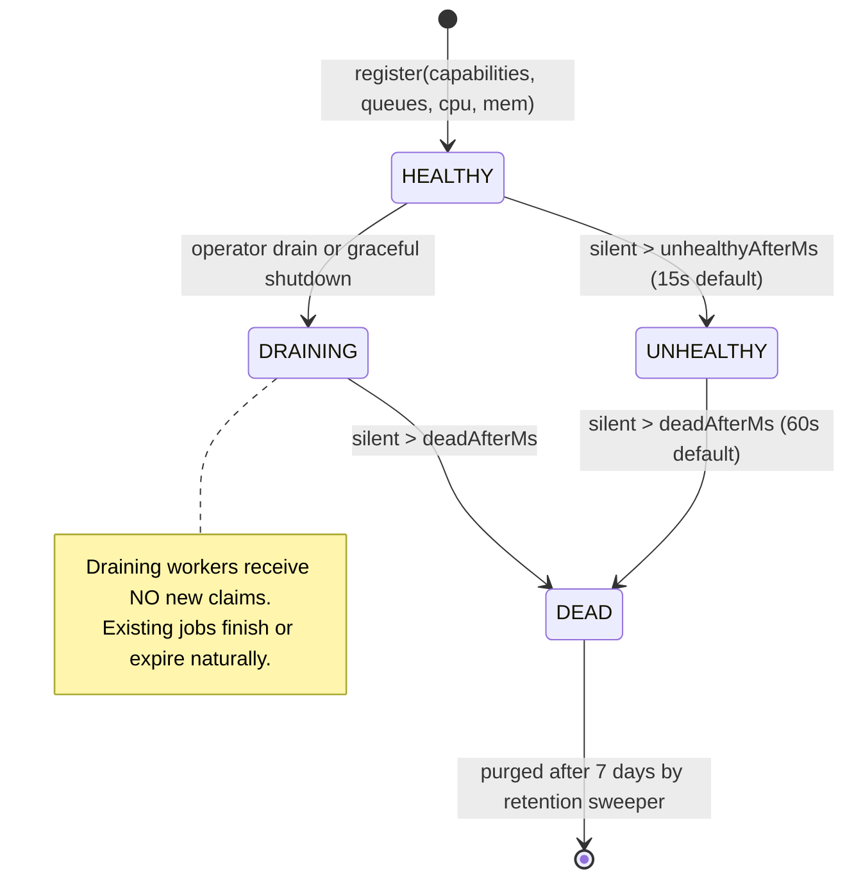
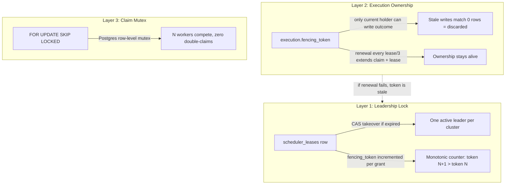
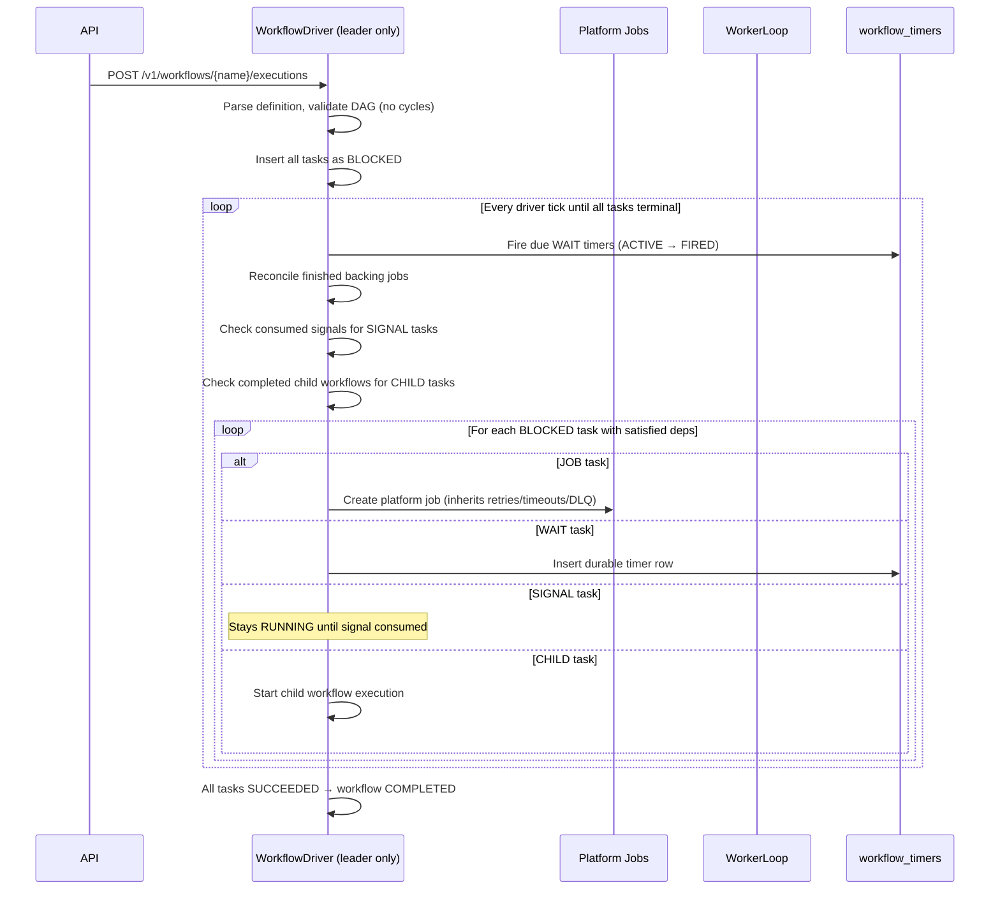
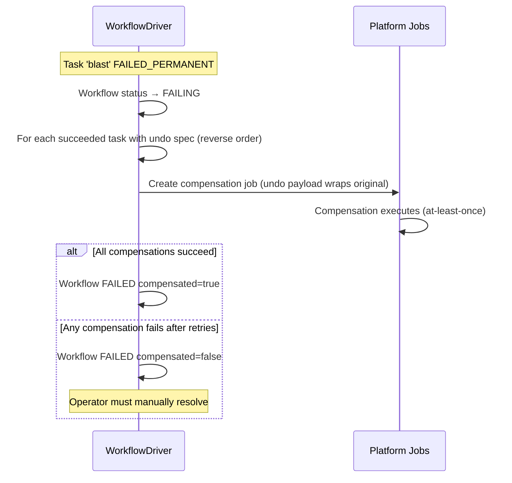
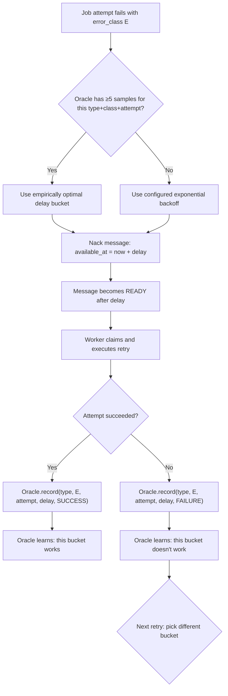
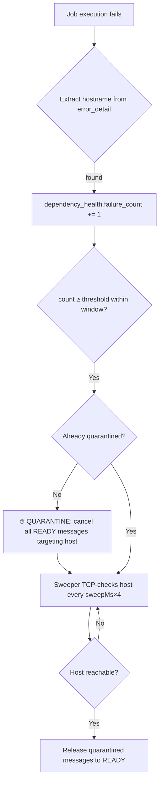
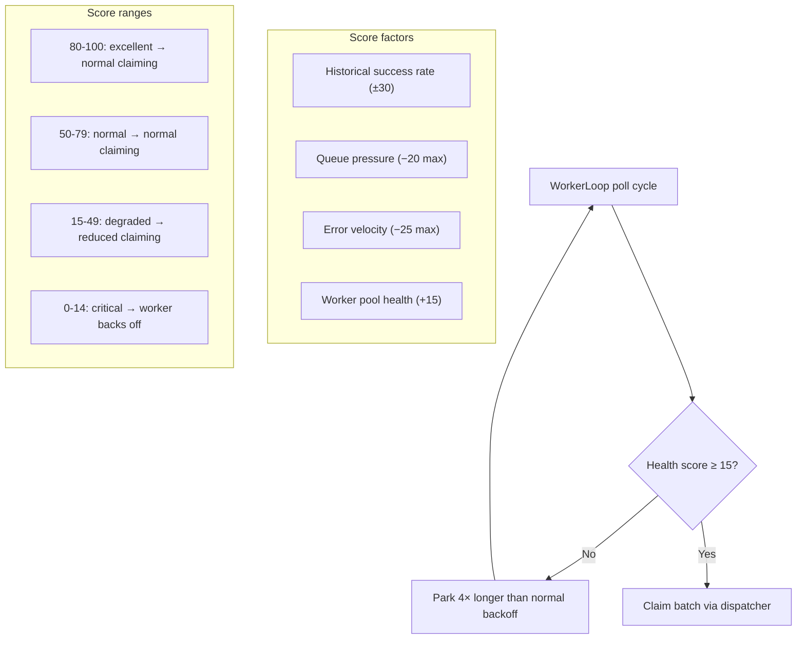
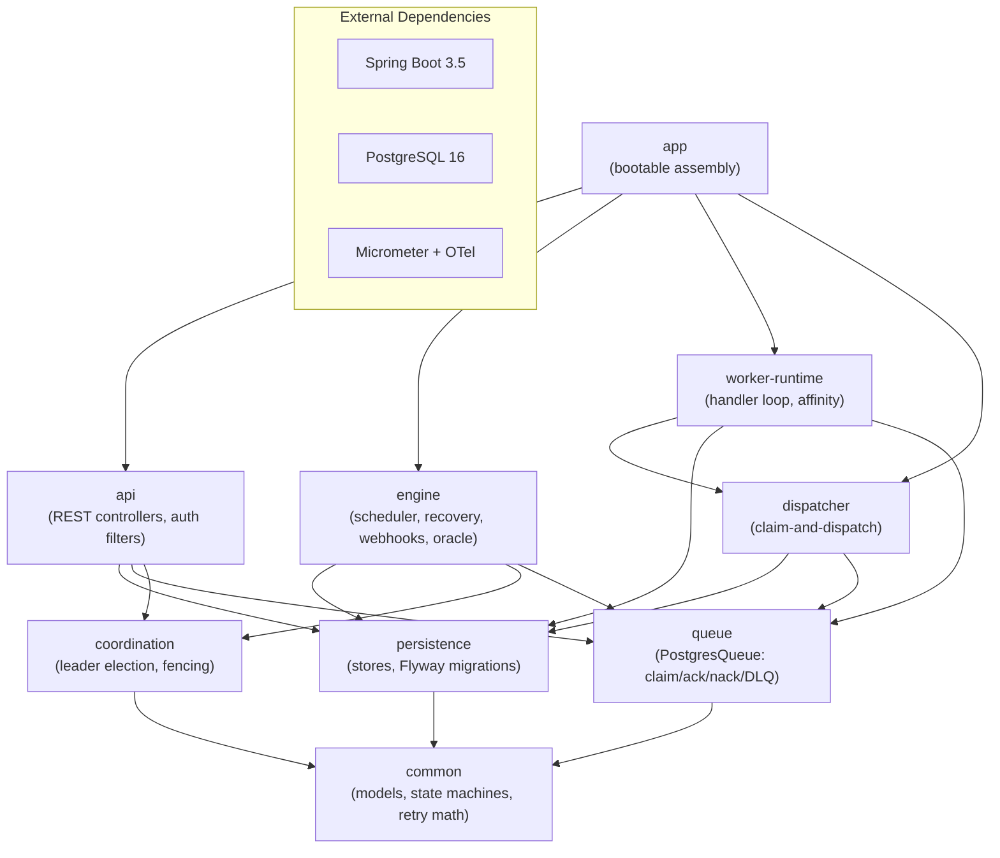

# Architecture

Schedula follows a **three-plane model** — Control (what should run), Coordination (who decides), Data (what actually runs) — inside a modular monolith that splits into separate processes via configuration flags.

```mermaid
graph TB
    subgraph ControlPlane["Control Plane"]
        UI["Admin UI :8080"]
        CLI["schedula.sh CLI"]
        subgraph APIModule["API Module"]
            AUTH["ApiKeyAuthFilter<br/>X-API-Key / X-Admin-Key"]
            SEC["SecurityHeadersFilter<br/>CSP · nosniff · DENY"]
            QUOTA["QuotaStore<br/>backlog + rate limits"]
        end
    end

    subgraph CoordPlane["Coordination Plane"]
        COORD["Coordinator<br/>probe → acquire → renew → stepDown"]
        LEASE["scheduler_leases<br/>(CAS + fencing token)"]
        NODES["scheduler_nodes<br/>(membership heartbeat)"]
    end

    subgraph DataPlane["Data Plane"]
        SCHED["SchedulerLoop<br/>cron · interval · backfill"]
        DISPATCH["DispatchService<br/>claim → create execution"]
        WORKER["WorkerLoop ×N<br/>virtual threads per handler"]
        WFD["WorkflowDriver<br/>DAG reconciliation"]
        WEBHOOK["WebhookDispatcher<br/>signed · circuit-breaker"]
        FW["CascadeFirewall<br/>auto-quarantine dead deps"]
        RET["RetentionService<br/>purge terminal history"]
        PRED["PressurePredictor<br/>trend detection"]
        ORACLE["RetryOracle<br/>adaptive delay learning"]
        ANOM["AnomalyDetector<br/>Welford 3-sigma SPC"]
    end

    subgraph Store[("PostgreSQL 16")]
        direction LR
        T1["jobs"]
        T2["queue_messages"]
        T3["workflow_*"]
        T4["scheduler_leases"]
        T5["retry_oracle"]
        T6["audit_events"]
    end

    UI --> AUTH
    CLI --> AUTH
    AUTH --> QUOTA
    QUOTA --> PG
    COORD --> LEASE
    COORD --> NODES
    SCHED --> PG
    DISPATCH --> PG
    WORKER --> PG
    WFD --> PG
    ORACLE --> PG
    ANOM --> PG
```

---

## Job State Machine

Every transition is a **guarded database UPDATE** — the database is the arbiter. Two racing writers cannot both succeed.



### Key invariant

> COMPLETED jobs can never execute again. Only `POST /v1/jobs/{id}/retry` creates a NEW job linked to the original by idempotency lineage.

---

## Worker Lifecycle



---

## Distributed Locking (Three Layers)



---

## Leader Election Sequence

```mermaid
sequenceDiagram
    participant A as Node A
    participant B as Node B
    participant DB as scheduler_leases

    Note over A,DB: Startup: both nodes register in scheduler_nodes

    A->>DB: CAS acquire (lease missing or expired?)
    DB-->>A: fencing_token=42, expires_at=now()+15s
    Note over A: A becomes LEADER (token=42)

    B->>DB: CAS acquire (lease held by A, not expired)
    DB-->>B: 0 rows → stay FOLLOWER

    Note over A: A crashes (no renewal sent)

    DB->>DB: Lease expires at now+15s

    B->>DB: CAS acquire (expires_at < now ✓)
    DB-->>B: fencing_token=43 (> 42 ✓)
    Note over B: B becomes LEADER (token=43)

    A wakes up and tries to renew
    A->>DB: renew WHERE owner=A AND token=42
    DB-->>A: 0 rows (owner changed to B) → STEP DOWN

    A attempts fenced write with old token 42
    A->>DB: UPDATE ... AND EXISTS(token=42 AND not expired)
    DB-->>A: 0 rows → WRITE INERT (cannot corrupt)
```

---

## Workflow Engine Execution



---

## Compensation Flow



> **Compensation is NOT rollback.** It is forward-running undo logic whose effects are themselves at-least-once and must be idempotent.

---

## Adaptive Retry Oracle Learning Loop



---

## Cascade Failure Firewall



---

## Webhook Circuit Breaker

```mel
stateDiagram-v2
    [*] --> CLOSED : webhook registered on job

    CLOSED --> OPEN : 5 consecutive delivery failures
    OPEN --> HALF_OPEN : cooldown expires (60s)
    HALF_OPEN --> CLOSED : next delivery succeeds
    HALF_OPEN --> OPEN : next delivery fails
```

---

## Predictive Health Scoring Gate



---

## Module Dependency Graph



---

## Deployment Topologies

### Development (single JVM)

All roles in one process. Demo profile seeds sample data.

```
java -jar app.jar --spring.profiles.active=demo
```

### Production (Kubernetes, 3 roles split)

| Component | Replicas | Scaling | Notes |
|-----------|----------|---------|-------|
| API | 2 | manual | Stateless behind load balancer |
| Scheduler | 3 | fixed | Leader-elected via PG lease; only leader acts |
| Workers | 3→HPA | queue-depth gauge | Subscribed to named queues; capability-matched |

Graceful shutdown: SIGTERM → stop claiming → finish inflight (≤30s) → release leadership → deregister → exit.
