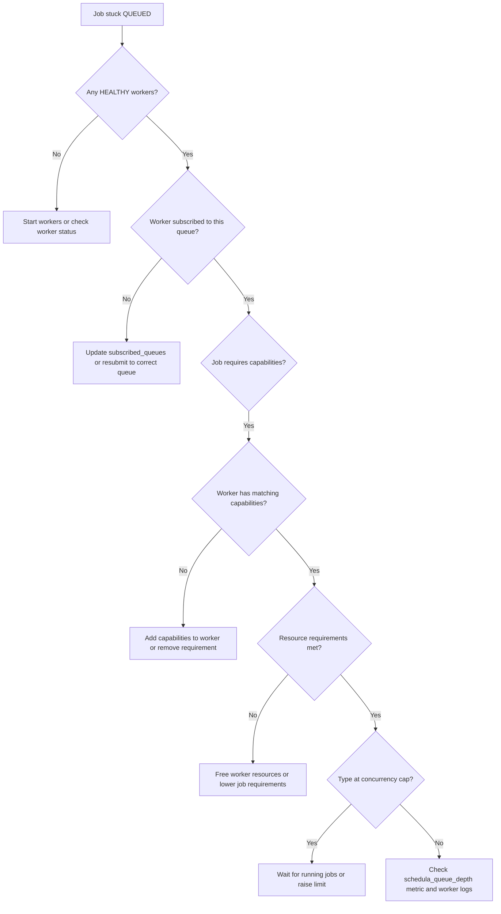
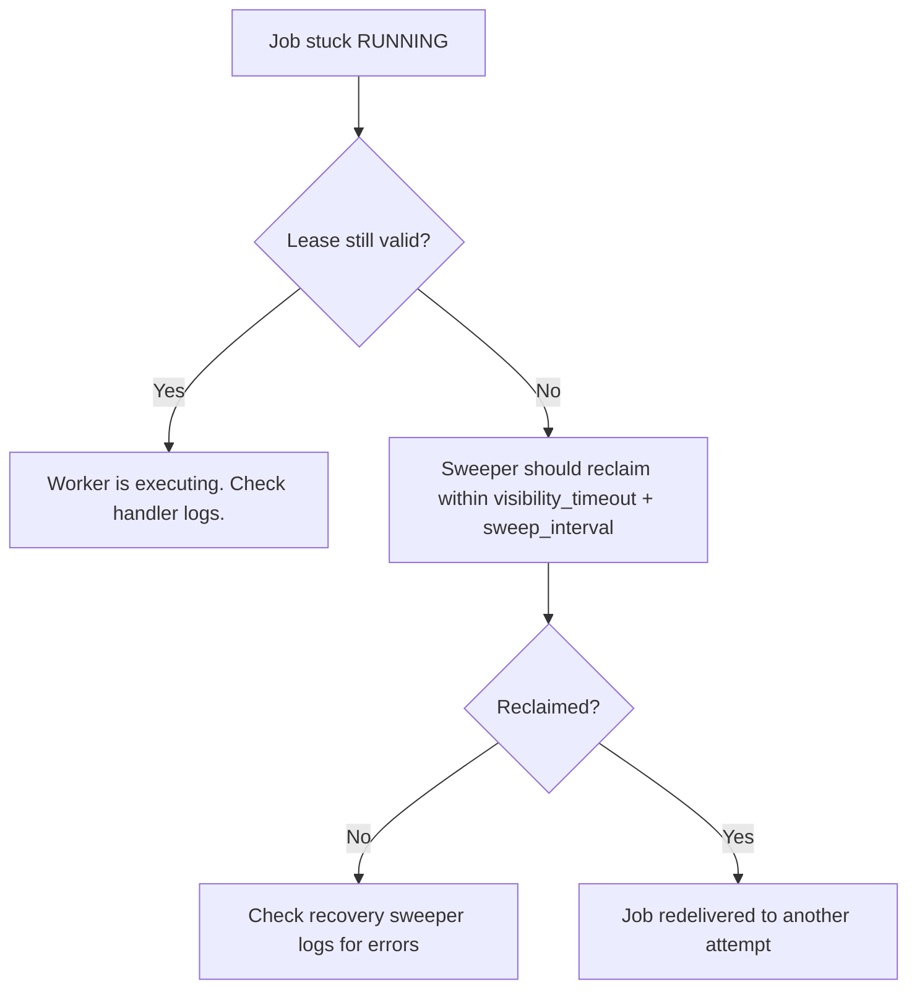
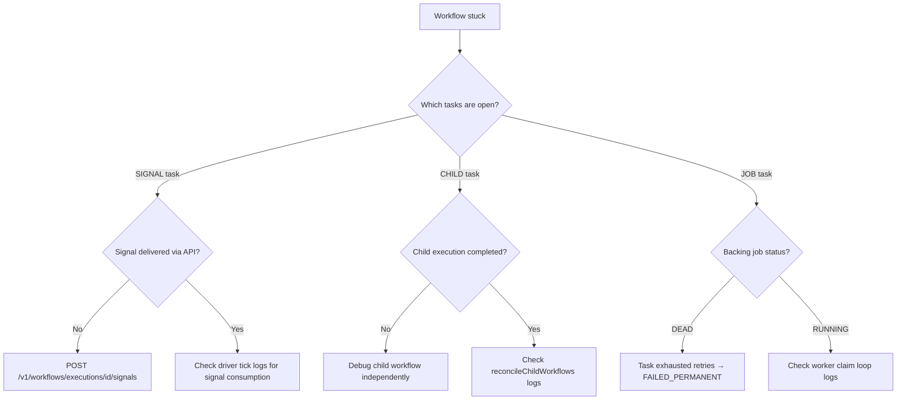
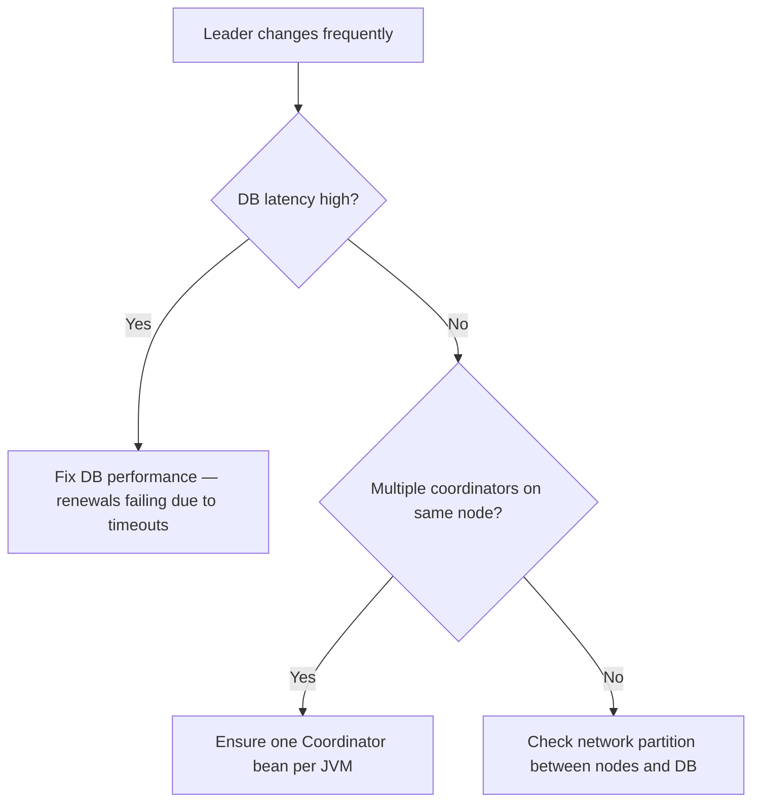

# Troubleshooting Guide

Decision trees for the most common operational issues.

## My job is stuck in QUEUED

## My job is stuck in RUNNING

## My workflow is stuck

## Leader keeps flapping

---

## Common Error Messages

| Error | Cause | Fix |
|-------|-------|-----|
| `no handler registered for type X` | Job submitted with unknown type | Register handler or fix type name |
| `operator does not exist: text = text[]` | Queue SQL parameter mismatch | Update PostgresQueue to latest |
| `variable might not have been initialized` | Constructor field assignment missing | Check all final fields assigned |
| `Could not obtain JDBC Connection` | PostgreSQL unreachable | Check Docker/PG status, verify connection URL |
| `fencing_token mismatch` | Stale owner attempted write | Expected during failover; alert if persistent |
